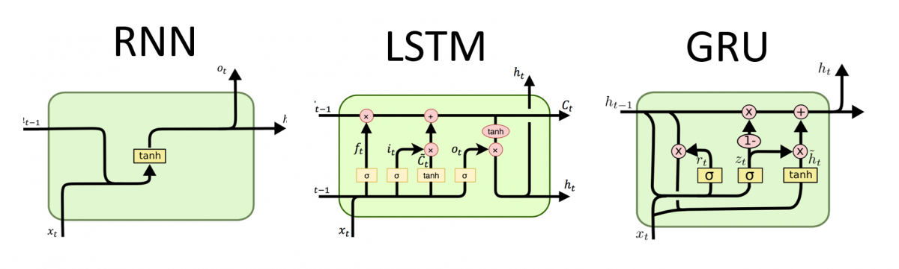

<!-- 
_header: ''
_footer: ''
_paginate: false
-->

# Ejemplos de predicción con redes neuronales artificiales

###### Departamento de Investigaciones Económicas
###### Agosto de 2020

---

# Red neuronal AR

- Armaremos un conjunto de entrenamiento que considera las últimas 12 observaciones como las variables predictoras del siguiente valor. 
  
- Utilizaremos datos del IPC como la secuencia de valores $Y_t$. 
  
- En particular, la red neuronal intentará aprender la hipótesis $\hat{f}$, en donde: 
$$ Y_{t} = \hat{f}(Y_{t-1}, Y_{t-2}, \ldots, Y_{t-12}) $$

--- 

# Redes neuronales recurrentes

- Es un tipo de red neuronal que toma en cuenta la secuencia en cada paso de predicción utilizando un lazo realimentación de la salida.
  - Los pesos son compartidos a través de cada iteración en el tiempo. 
  - Esto permite aprender patrones en diferentes partes de la secuencia. 

---

## Aplicaciones de los modelos de secuencias

*Imagen tomada del curso de [Sequence Models](https://www.coursera.org/learn/nlp-sequence-models/lecture/0h7gT/why-sequence-models) de Andrew Ng en Coursera*

--- 

## Tipos de redes neuronales recurrentes

<!-- - Tres de los tipos más comunes de redes neuronales son:  -->
  - Recurrent Neural Network (RNN): versión más simple con realimentación.
  - Long Short Term Memory (LSTM): cuenta con memoria y compuertas de actualización, olvido y salida.
  - Gated Recurrent Unit (GRU): pueden considerarse una versión simplificada de las de tipo LSTM.

Imagen tomada de *[RNN, LSTM & GRU](http://dprogrammer.org/rnn-lstm-gru)*

--- 

# Gated recurrent unit (GRU)

- Compuerta de actualización 
$$ z_t = \sigma(W_u[h_{t-1}, x_{t}] + b_u) $$
- Compuerta de reset
$$ r_t = \sigma(W_r[h_{t-1}, x_{t}] + b_r) $$
- Vector de activación candidato 
$$ \hat{h}_t = \tanh(W_h[r_t \times h_{t-1}, x_{t}] + b_h) $$
- Vector de activación de salida
$$ h_t = (1-z_t)\times h_{t-1} + z_t \times \hat{h}_t $$

---

# Red neuronal GRU

- Armaremos un conjunto de entrenamiento que considera las últimas 12 observaciones como las variables predictoras del siguiente valor. 
  
- Utilizaremos directamente los datos de inflación como la secuencia de valores $Y_t$. 
  
- Nuevamente, la red GRU intentará aprender la hipótesis $\hat{f}_{GRU}$, en donde: 
$$ Y_{t} = \hat{f}_{GRU}(Y_{t-1}, Y_{t-2}, \ldots, Y_{t-12}) $$
