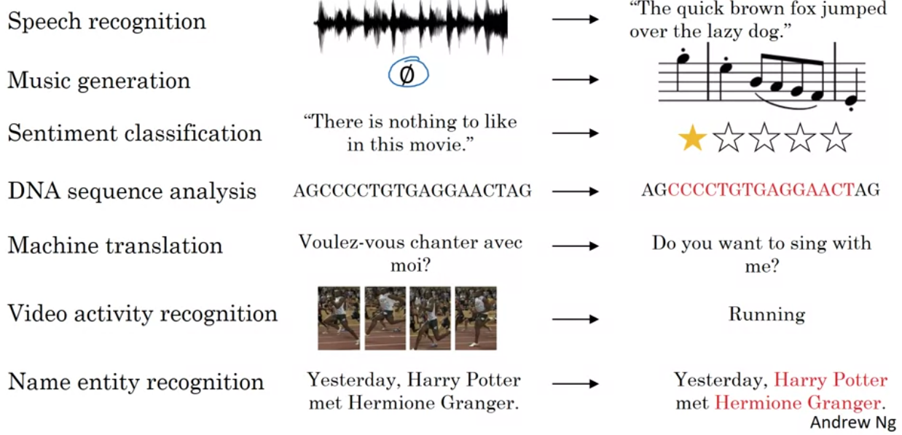

<!-- 
_header: ''
_footer: ''
_paginate: false
-->

# Introducción a NLP con Keras

###### Departamento de Investigaciones Económicas
###### Septiembre de 2020

---

## Representación de palabras: *word embeddings*

<!-- Imagen tomada del blog de Hariom Gautam, Word embedding: basics: https://medium.com/@hari4om/word-embedding-d816f643140 -->

---

## Glove 

- Es un algoritmo para representación de palabras utilizando amplios cuerpos de texto. 
- Tiene resultados muy interesantes: 
$$ (\text{mujer} - \text{hombre}) + \text{rey} = \text{?} $$
- Sitio oficial con *embeddings* pre-entrenados: 
  - [https://nlp.stanford.edu/projects/glove/](https://nlp.stanford.edu/projects/glove/)
  
- Existen otros algoritmos como `word2vec` o `fasttext`.
- Para cargar un modelo pre-entrenado utilizaremosl a libería `gensim`.
  
<!-- ---

## Aplicaciones de los modelos de secuencias

*Imagen tomada del curso de [Sequence Models](https://www.coursera.org/learn/nlp-sequence-models/lecture/0h7gT/why-sequence-models) de Andrew Ng en Coursera* -->

--- 

## Clasificación de sentimientos 

- Modelo de lenguaje u algoritmo que permite clasificar una frase, una reseña o comentario de acuerdo a su contenido semántico. 

- Hay algunas librerías en Python: 
  - `NLTK`
  - `TextBlob`
  
*Imagen tomada del blog CFML: [Sentiment Classification](https://cfml.se/blog/sentiment_classification/)*  

--- 
# Arquitectura del modelo 

---

<!-- Explicación del modelo a implementar con unidades LSTM -->